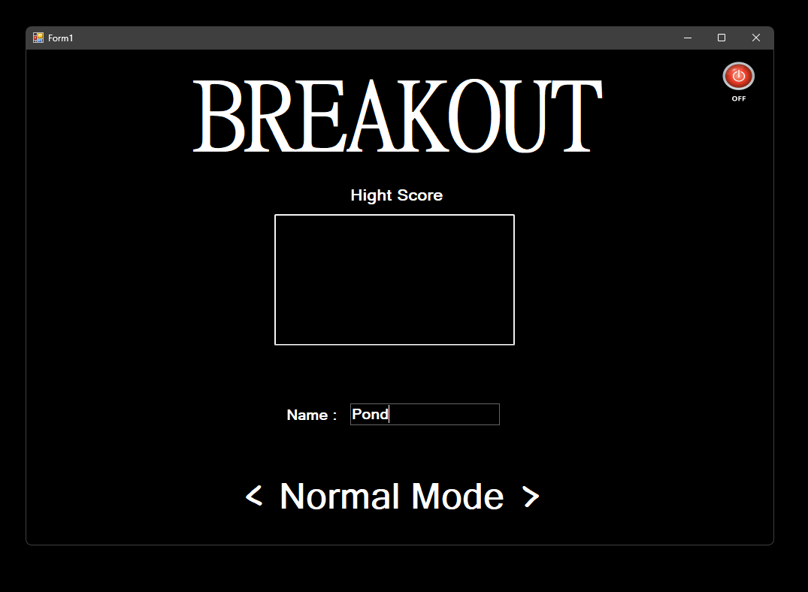
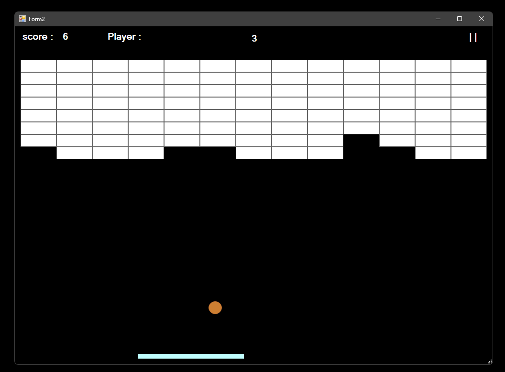
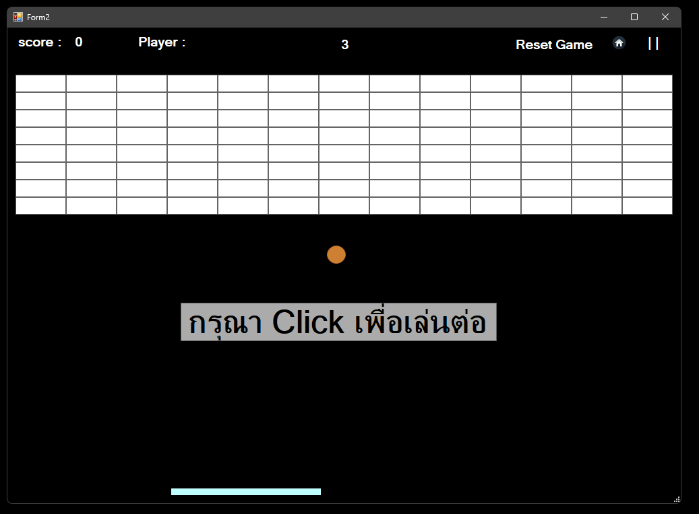
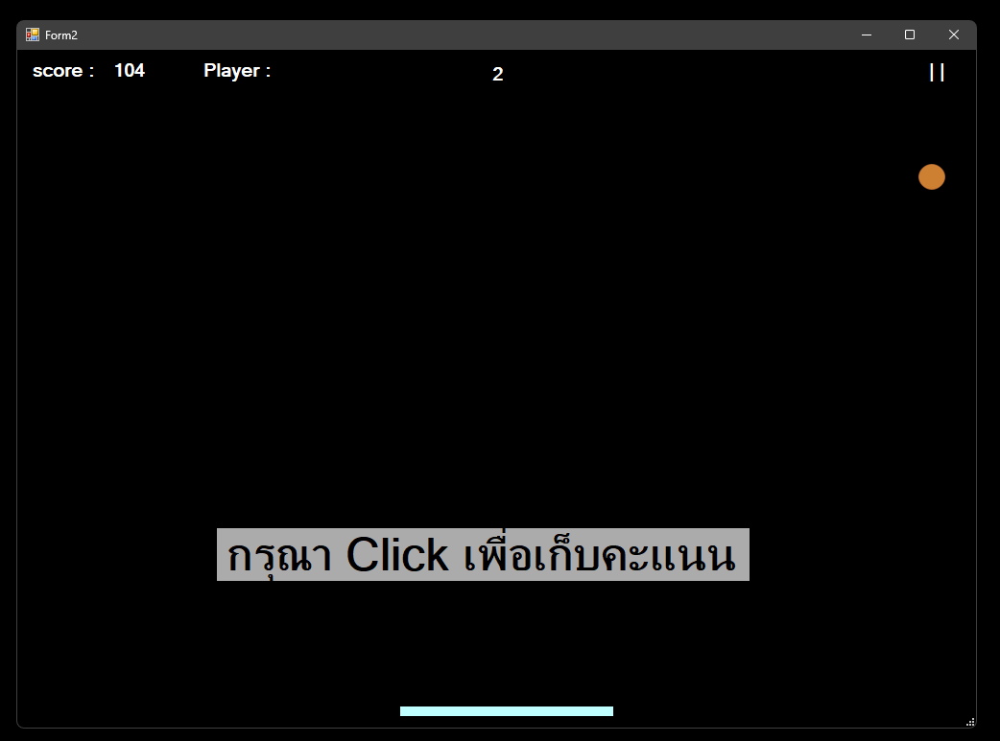
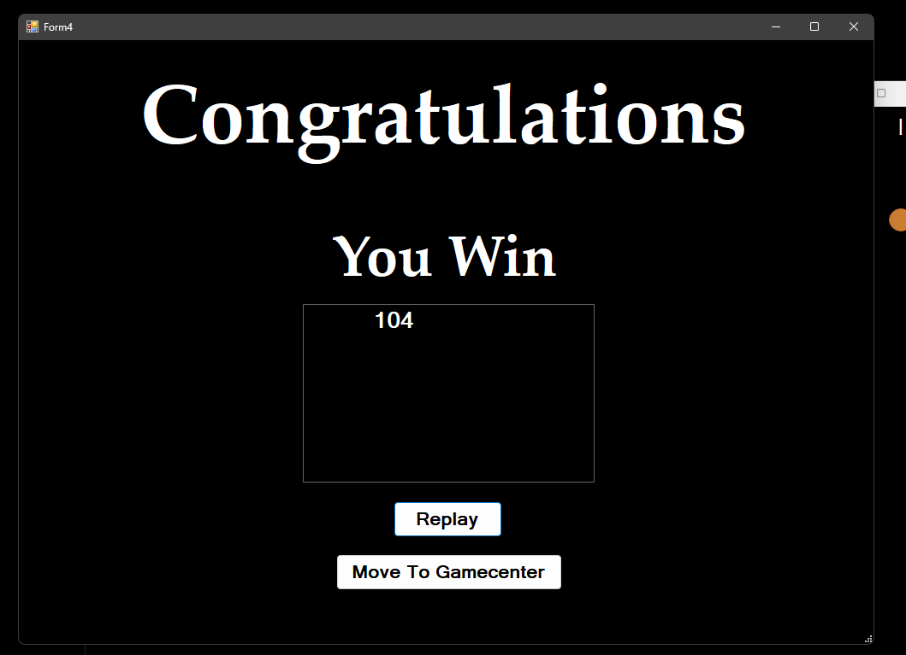
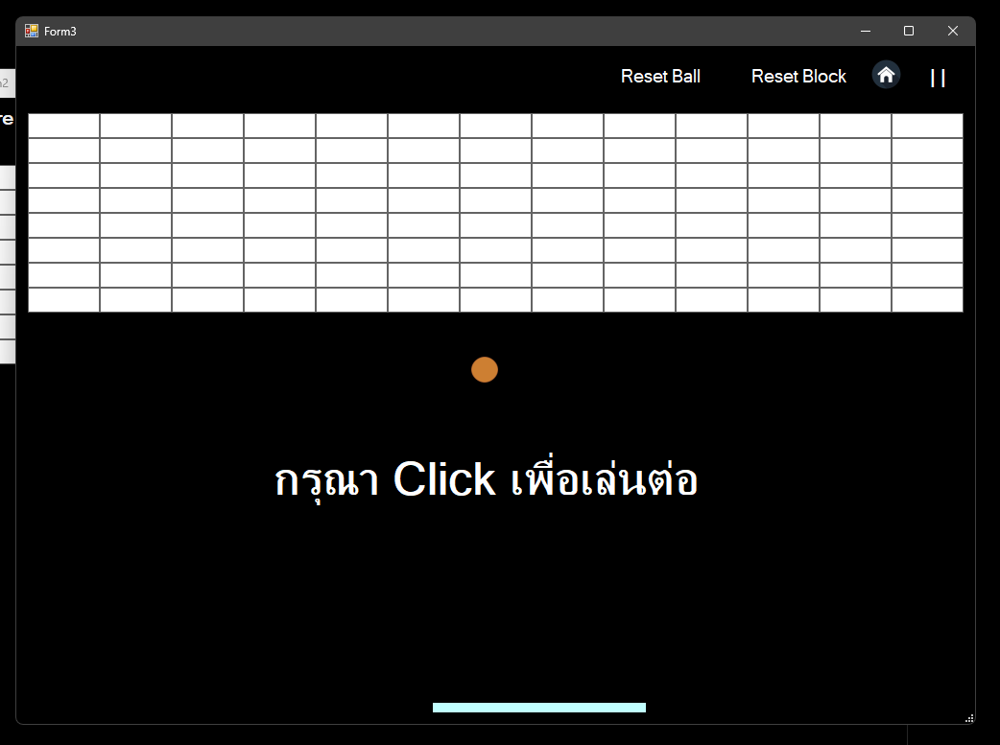

# โปรเจกต์เกม 2D Breakout
เป็นเกมที่ผู้เล่นต้องเลื่อนบอร์ดเพื่อเด่งลูกบอลให้โดนบล๊อคเพื่อทำลาย

### เครื่องมือที่ใช้
- Visual Studio

### ภาษาที่ใช้
- C#

## หน้าตาเกม

## หน้า Home ของเกม

## หน้าเกม

## หน้าหยุดเกม

## หน้า Dead

## หน้าจบเกม

## หน้าแสดงคะแนน

## หน้า Free mode

## รีเซ็ตบล๊อค

## รีเซ็ตบอล

